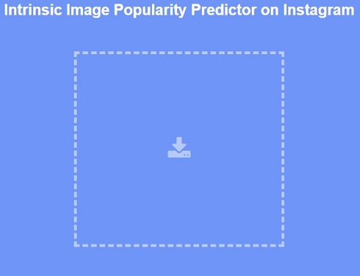

# Intrinsic image popularity on Instagram

This is a PyTorch implementation of *Intrinsic Image Popularity Prediction: Focusing on the Visual Content*.

run ```python test.py [image_path]``` to evaluate your intrinsic image popularity on Instagram. Please [click here](https://portland-my.sharepoint.com/:u:/g/personal/keyanding2-c_ad_cityu_edu_hk/EeQcNCrMrvRIor44lbj9hOsBN6qZ2SafvdB0auO7TAGchg?e=BxkeuN) to download the released pretrained model. 

Here is a [Web-based Demo](http://keyan.ink/). 


<!-- **Wait to add**:
1. The raw data of 150 million Instagram post information.
2. The generated DPIP dataset.  -->
